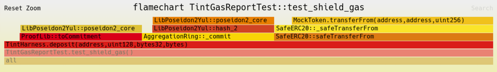
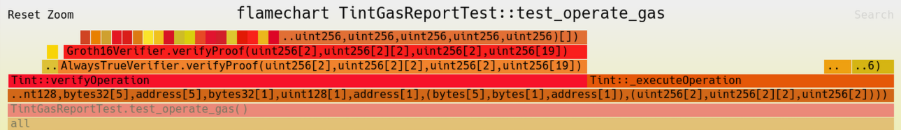
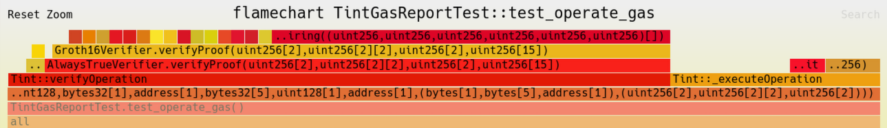
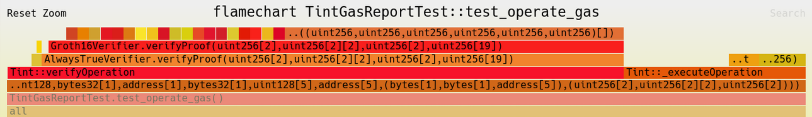

# Tint

Tint is an EVM-focused utxo-based proof-of-concept privacy protocol.  It's designed with the following goals:
- Optimized gas usage, especially focused on cheap shielding.
- Arbitrary note ownership rules.

## Gas Costs

Tint is designed to be maximally gas efficient. It achieves this primarily by reducing the gas cost to commit notes to the merkle tree, which is generally the most expensive part of tornadocash/railgun/ppv1. Tint does this by deferring merkle tree updates to inside the circuit.

When shielding, the note's commitment hash is added to a staging queue on-chain. When any user next performs a transfer or unshield, they will include a batch of staged notes in their proof, which atomically inserts up to 64 notes into the merkle tree. Doing this:
- The gas cost of shielding is reduced to two poseidon2 hashes and a single storage write.
- The gas cost of transfers and unshields are increased by ~35k gas (2 additional public inputs to the circuit and 1 additional storage write).

So long as each transfer / unshield includes on average at least 0.14 shields, this results in a net gas savings.

### Gas Benchmarks

All below gas costs are based on Ethereum Mainnet and exclude the cost of token transfers.

**Shields:** 43,303

**Transfers / Unshields:**

| Circuit | Gas Cost | Cost per addition |
| ------- | -------- | ----------------- |
| 1x1x1   | 341,964  | N/A               |
| 5x1x1   | 495,774  | 38,452            |
| 1x5x1   | 371,766  | 7,450             |
| 1x1x5   | 401,786  | 14,955            |

### Flamegraphs

| Circuit | Flamegraph                              |
| ------- | --------------------------------------- |
| Shield  |  |
| 5x1x1   |    |
| 1x5x1   |    |
| 1x1x5   |    |

## Arbitrary Note Ownership Rules

Tint allows for arbitrary note ownership rules, meaning the conditions under which a note can be spent are decided by the note creator. Each note commits itself to a "spendability address". When a note is spent, the contract calls the `spendable` function on the spendability address, which determines whether the note can be spent.

This allows for numerous spendability rules, including:
- Secret key ownership
- Multi-sigs
- Hardware wallet compatibility via `eth_signTypedData_v4`
- Timelocks
- Limit orders

To preserve privacy, spendability circuits will generally require a zk-proof.  This means spendability rules will generally cost an additional ~300k.

[Spendability Docs](./docs/spendability.md)

## Paymaster / Frame transaction compatibility

Tint seperates the validation & execution phases for transfers and unshields.  This allows for improved compatibility with paymasters and frame transactions.  The validation phase can be performed in the `validatePaymasterUserOp` or `VERIFY` frame (in the former case writing a state marker to tstore, in the latter case that not being required).  
