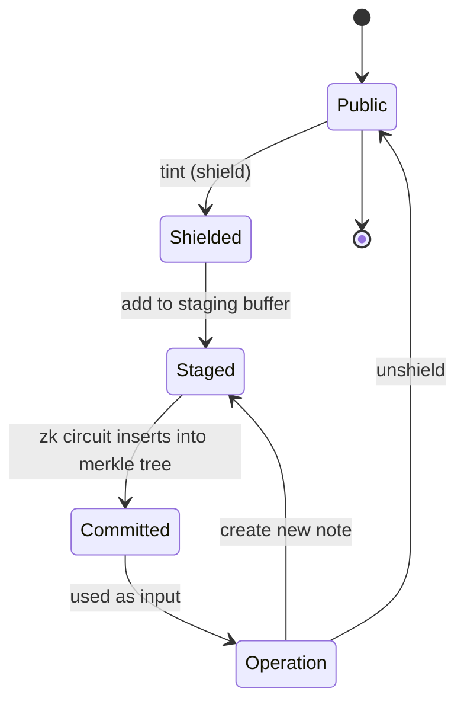

# Note Lifecycle



## Staging

Tint's staging process is responsible for inserting new notes into the commitment merkle tree. Unlike other privacy protocols, Tint does not immediately insert new notes into the merkle tree on-chain. Inserting new notes one at a time into the merkle tree on-chain is expensive (~300-500k gas), requiring 5-10 poseidon hashes per note.

Instead, new notes are cheaply appended to an ordered hash chain (the staging buffer). A ZK circuit can then prove that an ordered batch of buffered notes was correctly inserted into the merkle tree. This lets Tint perform the merkle tree insertion off-chain while still being provably correct.

```solidity
/// Hash chain creates a linked list of buffered notes.
uint256 newHash = LibPoseidon2T2_BN254.compress(prevHash, newNote, 0);
```

Furthermore, by combining the commitment proof with the operation proof, Tint (generally) allows users to commit and spend a new note in a single operation.

### Benefits

- Cost of insertion drops from "per-note merkle tree insertion" to "per note hash chain insertion"
- Because the circuit first inserts new notes, then verifies the operation, operations can consume uncommitted notes as inputs without any loss of privacy.

### Drawbacks

- Using batch-insertion limits the number of notes that can be committed at once. Tint's circuit currently supports a maximum of 64 notes per batch. If there are more than 64 pending notes, a user would not be able to shield and immediately spend a note.

